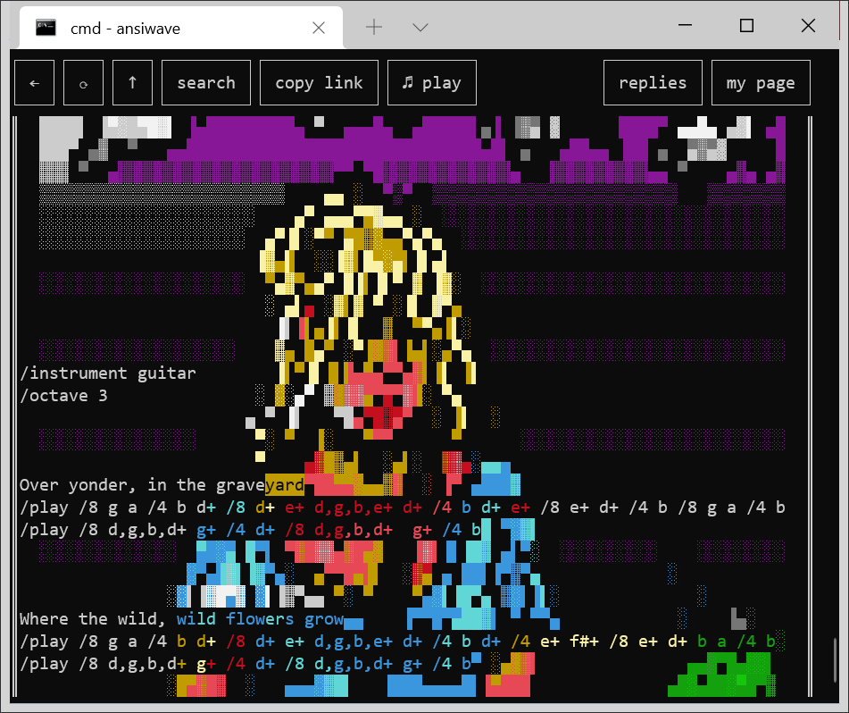

The haters told me BBSes, ANSI art and MIDI music were dead so I combined them together.

<a href="http://bbs.ansiwave.net/bbs.html#type:post,id:bQOPvkpT5NfTM8kK311q0R1NvMmfdWs5liOyTgtyHcoz88LEQWJwVp-6Ktgk0vn9KxmsH-100u0OgAg1FqzeCQ,board:kEKgeSd3-74Uy0bfOOJ9mj0qW3KpMpXBGrrQdUv190E">&lt;-- click me</a>

ANSIWAVE BBS is a retro-futuristic bulletin board where you can have threaded discussions and share ANSI art and MIDI music. It is the glorious mashup that nobody asked for and everybody needs.

* Download [the terminal client](https://ansiwave.net) for windows, macos, or linux
* Enter [the web portal](http://bbs.ansiwave.net/bbs.html)
* Watch [the screencast](https://www.youtube.com/watch?v=iOuCGyizPlk)
* Join [the subreddit](https://www.reddit.com/r/ANSIWAVE/) in case the BBS has a bad day (it will)

## How to fire this puppy up and get 'er done

Either download [a prebuilt binary](https://ansiwave.net), or you can build from source: [install Nim](https://nim-lang.org/install.html) and then do `nimble install ansiwave` (make sure `~/.nimble/bin` is on your PATH).

To access the BBS, just run it without any arguments:

```
ansiwave
```

If you have a specific post you want to go to, you can just give the URL as the argument:

```
ansiwave http://bbs.ansiwave.net/bbs.html#...
```

To view the BBS offline, clone it with git and point the terminal client to it:

```
git clone http://bbs.ansiwave.net/boards/kEKgeSd3-74Uy0bfOOJ9mj0qW3KpMpXBGrrQdUv190E/.git

ansiwave kEKgeSd3-74Uy0bfOOJ9mj0qW3KpMpXBGrrQdUv190E
```

You can also use ANSIWAVE as an offline tool; no need to share your creations on the BBS. You can open a new or existing file like this:

```
ansiwave hello.ansiwave
```

On the web portal of the BBS, there is a "plain view" button which takes you to a pure HTML version of the post. Its URL is very long because it contains the entire content inside of it. You can then open it in the terminal client like this:

```
ansiwave http://bbs.ansiwave.net/view.html#...
```

And you can save it to a file like this:

```
ansiwave http://bbs.ansiwave.net/view.html#... hello.ansiwave
```

There are a couple other cool things you can do. If you have a .ansiwave file, you can synthesize the music in it to a wav file:

```
ansiwave hello.ansiwave hello.wav
```

And if you have any old-school ANSI art encoded in CP437, you can convert it into an ansiwave:

```
ansiwave hello.ans hello.ansiwave --width=80
```

Oh, and if you just want to look at an ansiwave, there is already an ansiwave viewer built into every 'nix machine on the planet:

```
cat hello.ansiwave
```

It's just unicode, homies!
